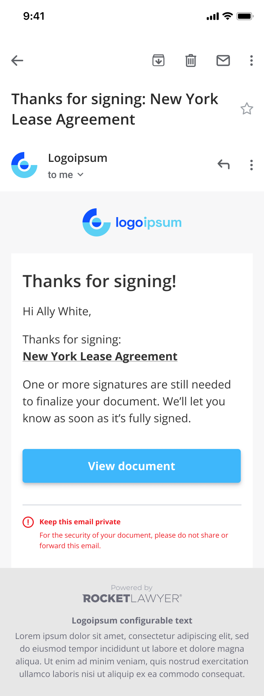
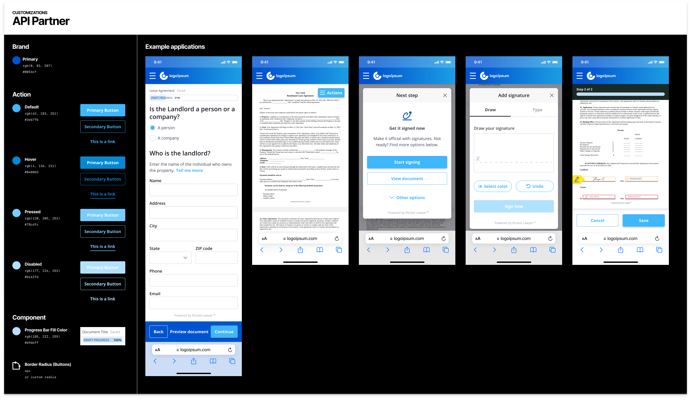

Customizing UX Products
=======================

Rocket Lawyer UX Products are built with the Rocket Lawyer Foundation Design System. Our design system supports a number of parameters that can be used to customize the look and feel of your apps to express your brand. This guide will describe the process of updating the branding in your app(s) and each of the supported parameters.

Updating your apps
------------------

Out of the box, your apps will express a generic "Logo Ipsum" brand. To update the look and feel of the UX product, you will need to complete this form. This will queue the update to be applied by our customer support team. Your update should be applied within 24 hours. You will be notified once it has.

[App Update Form](https://docs.google.com/forms/d/e/1FAIpQLSddJPPg0onclKYf2IIyRehCYwlTtlcogXXXxo0ZlwtZLd3ZZQ/viewform)

Your Logo
---------

Your logo is rendered in the header of emails that are sent by our API Products. We need you to provide a large png image (~1024px wide). Usually the logo is wider than it is tall. Ideally it has a transparent background. We will render it to the dimensions required by our latest email template designs. Here is an example.

Design System Parameters
------------------------

[Enlarge Image](images/API_Partner_Customizations.png)

The following parameters can be used to control the look and feel of the user interface.

### Brand Primary

Used in prominent UI’s like the background color for navigation elements and iconography throughout the product.

Default: #0053CF

_Note: Please avoid using white (#FFFFFF) or colors that register close to white. Brand Primary color should not be the same as Action colors._

### Action Primary

The color of buttons and links in their default state throughout the UI.

Default: #3EB7FB

_Note: Please avoid using white (#FFFFFF) or colors that register close to white. Action colors should not be the same as Brand Primary color._

### Action Primary Hover

The color of buttons and links in their hover state throughout the UI.

Default: #0488D3

_Note: Please avoid using white (#FFFFFF) or colors that register close to white. Action colors should not be the same as Brand Primary color._

### Action Primary Pressed

The color of buttons and links in their pressed / focused state throughout the UI.

Default: #78CDFC

_Note: Please avoid using white (#FFFFFF) or colors that register close to white. Action colors should not be the same as Brand Primary color._

### Action Primary Disabled

The color of buttons and links in their disabled state throughout the UI.

Default: #B1E2FD

_Note: Please avoid using white (#FFFFFF) or colors that register close to white. Action colors should not be the same as Brand Primary color._

### Button Border Radius

The button border radius used in buttons throughout the UI.

Default: 4px

_Note: Border radius cannot exceed 24px because button height is 48px._

### Progress Bar Fill Color

The fill color for the progress bar UI component.

Default: #B9DEFF

_Note: Please avoid using white (#FFFFFF) or black (#000000) or colors that register close to white or black._
