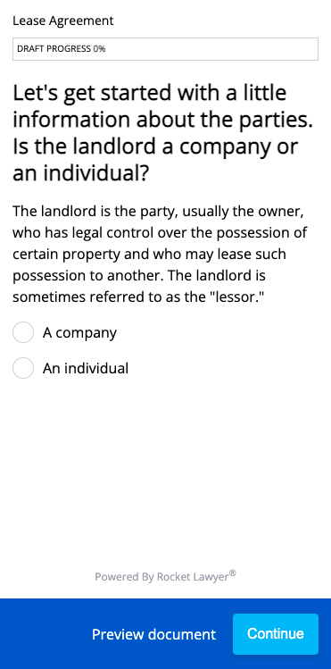

RocketDocument Embedded UX
==========================

This Quick Start walks you through how to use the **RocketDocument™ Embedded UX** to make and customize a Rocket Lawyer document using our simple interview-style experience. After finishing the steps, you’ll be able to make a complete document, which you can then display with the **RocketSign® Embedded UX**.

What you’ll need
----------------

1.  **Client credentials**
    *   These can be obtained through the onboarding process in the [Welcome Guide](welcome-guide)
2.  **templateId**
    *   This is the unique ID of the template used to initialize the interview. For example, for a lease agreement, you can use this: `04d9d0ba-3113-40d3-9a4e-e7b226a72154`
3.  **partnerEndUserId**
    *   An ID that identifies the end user in your system.
4.  **partyEmailAddress**
    *   The end user’s email address to use for notification about their document(s).

Getting started
---------------

### Step 1: Generate access token

**Note:** Urls in this Quick Start use `api-sandbox.rocketlawyer.com`. For production, please use `api.rocketlawyer.com`.

Each call to the **RocketDocument API** has to be authenticated. In order to obtain an Access Token, you must perform a call to the \[Authentication API\](/docs/partner-auth-service-product-sandbox/1/routes/accesstoken/post): \`\`\`

    POST https://api-sandbox.rocketlawyer.com/partners/v1/auth/accesstoken

with correct credentials (client\_id and client\_secret) and **grant_type**: 

    {
        "client_id": "{api-key}",
        "client_secret": "{api-secret}",
        "grant_type": "client\_credentials"
    }

Response will contain an Access Token (amongst other data):  

     "access_token": "eyJ0eXAiOiJKV1QiLCJhbGciOiJIUzI1NiJ9.(content redacted).tBX73KTTjopBSRDL0cIBt3EK\_DcA3Jc9KKonbpBn6HE"

**Note:** Token content has been redacted in the example to ensure security.

### Step 2: Create the interview

Assumptions for creating an interview:

*   You have the `templateId` for the template for which to base the interview. In this quickstart, we are using the templateId for a Lease Agreement. If you wish to create a different document type, you’ll need a different templateId.
*   You have the `partnerEndUserId` for the end user. The one used in this example is not valid.

**Request**
To create an interview, make a POST request to the interviews endpoint in the [RocketDocument API](/docs/rocketdoc-api-product-sandbox/1/routes/interviews/post): \`\`\`

    POST https://api-sandbox.rocketlawyer.com/rocketdoc/v1/interviews \`\`\`

Authorization header where \`\`\`{accessToken}\`\`\` is obtained in step 1: \`\`\`

    "Authorization: Bearer {accessToken}"

Body of the request should contain:

     {
        "templateId": "04d9d0ba-3113-40d3-9a4e-e7b226a72154",
        "partyEmailAddress": "me@emailaddress.com",
        "partnerEndUserId": "cfd1ee5a-061a-40cc-be72-8cbb9945b5d9"
    } `

**Response**

Body:

    {
        "interviewId": "0af17ba7-f332-5346-bb3f-00b7c9af7deb"
    }

Header:

    "rl-rdoc-servicetoken: eyJ0eXAiOiJKV1QiLCJhbGciOiJIUzI1NiJ9.(content redacted).zZOGi0TbfqzzCnJbo8hbpDnNwkjr4sPxeTi9KyIT3LY"

You’ll need this `rl-rdoc-servicetoken` for all subsequent interview related calls to be used in your authorization header like this:
`"Authorization: bearer {rl-rdoc-servicetoken}"`.

### Step 3: Access the RocketDocument UI

To embed the RocketDocument UX in your UI you will need:

The source code for the RocketDocument UI in the header of your html:

    

The web component tag somewhere in the body of your html:

    <rocket-document serviceToken={rl-rdoc-servicetoken} interviewId={interview-id}></rocket-document>

 `{rl-rdoc-servicetoken}` is the service token from the previous step. You can find more on access and service tokens at [**Authentication API Documentation**](/docs/partner-auth-service-product-sandbox/1/overview)

`{interview-id}` is from the body of the response in the previous step. (not the same as template id)

A simplified webpage example:

    <!DOCTYPE html>
    <html lang="en">
      <head>
        <title>RocketDocument Demo</title>
        
      </head>
      <body>
        

          <rocket-document
            serviceToken="..."
            interviewId="..."></rocket-document>
        

      </body>
    </html>

### Step 4: Display your document

After RocketDocument Embedded UX loads, you should see your interview ready to be interacted with:

Congratulations! You have just displayed the document using **RocketDocument Embedded UX**

### Step 5 (optional): Integrating with **RocketSign**

If you're integrating with **RocketSign**, you'll need to retrieve the Interview JSON Object and persist the **binderId**. You should also retain the service token you aquired in step 2 (rl-rdoc-servicetoken) as it can be re-used when you integrate with RocketSign.

**Request**

    GET https://api-sandbox.rocketlawyer.com/rocketdoc/v1/interviews/{interviewId} \`\`\`

**Example Response**

    {
        "binder":
            {
                "binderId": "0af17ba7-f332-5346-bb3f-00b7c9af7deb",
                "documentId": "7d989647-ecf2-4673-9486-80c3b890ed3c"
            },
        "interview":
            {
                "answersPayload":
                    {
                        "version": 2,
                        "Fk8jctrn744ku5": true,
                        "Fk8jd1no93zprz": "My Business",
                        "Fk8jd4pfntjpvf": false,
                        "Fk8jdel8mfwiot": "415 9999999"
                    },
                "createdAt": "2020-12-01T17:51:40.795Z",
                "updatedAt": "2021-12-01T18:51:40.795Z",
                "interviewName": "Employment contract",
                "interviewId": "0af17ba7-f332-5346-bb3f-00b7c9af7deb",
                "interviewStatus": "created",
                "templateVersionId": "7d989647-ecf2-4673-9486-80c3b890ed3c"
            },
        "template":
            {
                "name": "string",
                "payload": "string"
            }
    }

### Next Steps

Now that you can create a document interview, display and interact with it, check out these resources:

**Quick Starts**

*   [Quick Start: RocketSign Embedded UX](rocketsign-embedded-ux)

**API documentation**

*   [RocketDocument API documentation](/docs/rocketdoc-api-product-sandbox/1/overview)
*   [Authentication API documentation](/docs/partner-auth-service-product-sandbox/1/overview)
