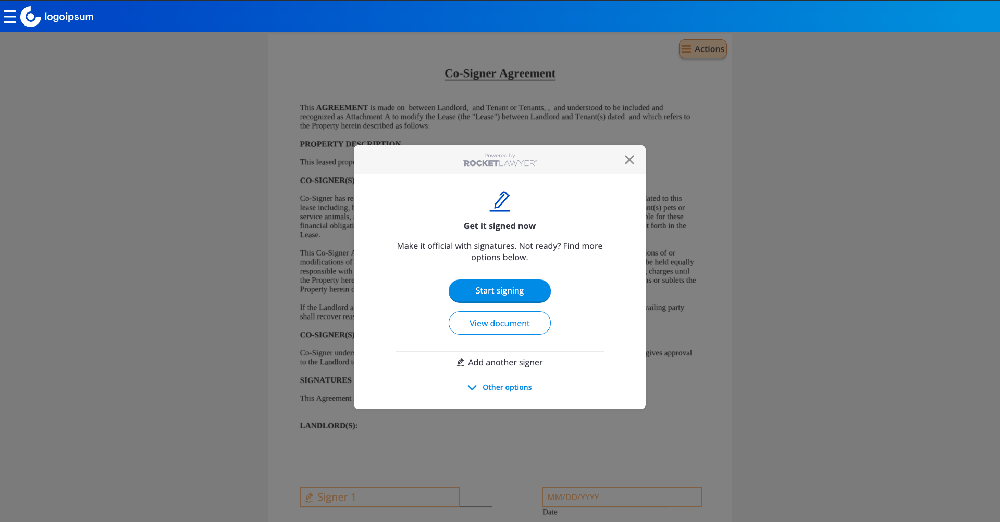

RocketSign Embedded UX
======================

This Quick Start walks you through how to display and interact with your documents using the **RocketSign® Embedded UX**. After finishing the steps, you’ll be able to perform all actions related to signing including getting a document ready to sign, signing it and inviting others to sign.

What you’ll need
----------------

1.  **Client credentials**
    *   These can be obtained through the onboarding process in the [Welcome Guide](welcome-guide.md)
2.  **binderId**
    *   This is unique ID of the binder to display. You can get this by following [Quick Start: RocketDocument Embedded UX](quick-start-rocketdoc-embedux.md)

Getting started
---------------

### Step 1: Generate access token

**Note:** Urls in this Quick Start use `api-sandbox.rocketlawyer.com`. For production, please use `api.rocketlawyer.com`.

Each call to the **RocketSign & Binders API** has to be authenticated. In order to obtain an Access Token, you must perform a call to the [Authentication API](../openapi/authentication.page.yaml):

    POST https://api-sandbox.rocketlawyer.com/partners/v1/auth/accesstoken

with correct credentials (`client_id` and `client_secret`) and `grant_type`:

    {
        "client_id": "{api-key}",
        "client_secret": "{api-secret}",
        "grant_type": "client\_credentials"
    }
The response will contain an Access Token (amongst other data):

    "access_token": "eyJ0eXAiOiJKV1QiLCJhbGciOiJIUzI1NiJ9.(content redacted).tBX73KTTjopBSRDL0cIBt3EK_DcA3Jc9KKonbpBn6HE"

**Note:** Token content has been redacted in the example to ensure security.

### Step 2: Generate service token

**Note:** It is highly recommended for you to use service token provided in [RocketDocument Quick Start](quick-start-rocketdoc-embedux.md).

After generating an Access Token in the previous step, you can now generate a Service Token, by once again calling the Authentication API:

    POST https://api-sandbox.rocketlawyer.com/partners/v1/auth/servicetoken

You authenticate the call by passing the Access Token in the Authorization HTTP header as a bearer token:

    "Authorization" : "Bearer {accessToken}"

The body of the request should contain:

    {
        "purpose": "api.rocketlawyer.com/document-manager/v1/binders",
        "expirationTime": 160780393200,
        "upid": "9b713671-3b19-470e-85b6-191f2fc09a7a"
    }

*   `purpose` is the purpose of this Service Token
*   `expirationTime` is the Unix timestamp in millisecond of the point in time until the token should be valid
*   `upid` is the UUID of a Party viewing the document

**UPID**

In order to discover the possible UPIDs for a binder, you need to execute a GET call:

    GET https://api-sandbox.rocketlawyer.com/document-manager/v1/binders/{binderId}

You authenticate the call by passing the Access Token in the Authorization HTTP header as a bearer token:

    "Authorization" : "Bearer {accessToken}"

The response should contain:

    {
        ...
        "parties": [
            {
                "id": "48cde627-de0c-4b9a-997b-c0bba2c81903",
                "reference": "5b39765b-1534-58fb-95d0-c1972d6e4156",
                "email": "aUser@rocketlawyer.co.uk",
                "jobTitle": "Document Owner",
                "personId": "1929006e-caf8-46d5-852b-27fe0b011bd5",
                "roles": [ "OWNER", "SIGNER" ],
                "status": "VIEWED"
            },
            {
                "id": "d4ac2b88-c262-4d9e-9728-7a7e6c794f0f",
                "reference": "Tenant_Name[0]",
                "jobTitle": "Document Signer",
                "roles": [ "SIGNER" ],
                "status": "PENDING"
            }
           ],
        ...
    }

One party’s id should be used as the UPID for your service token request.

### Step 3: Access the RocketSign UI

Go to your web browser, and open the url:

    https://document-manager.sandbox.rocketlawyer.com/{binderId}#serviceToken={serviceToken}

*   `binderId` is the ID of your binder
*   `serviceToken` is the service token you created in the previous steps. You can find more on access and service tokens on: [**Authentication API Documentation**](../openapi/authentication.page.yaml)

You can get the `binderId` from the document you have created yourself using the [**RocketDocument Embedded UX**](quick-start-rocketdoc-embedux.md)

### Step 4: Display your document

After **RocketSign Embedded UX** loads, you should see your document ready for preparation and signing:

The document is now ready for the preparation and signing process:

*   you can add signature boxes for existing signers
*   you can add more signers and viewers
*   you can sign the document yourself

Congratulations! You have just displayed the document using **RocketSign Embedded UX**

### Embed RocketSign Embedded UX into your platform

The application can be embedded on a page within your platform via an iFrame. This allows you to authenticate users before redirecting them to the page containing the iFrame (only you can grant access to a user to view or sign a document, or invite others to sign it).

The URL to embed the iFrame is:

    https://document-manager.rocketlawyer.com/{binderId}#serviceToken={serviceToken}

A practical example of embedding the application is given below:

    <iframe
    id="rocketSignFrame"
    src="https://document-manager.rocketlawyer.com/{binderId}#serviceToken={serviceToken}"
    style="width: 100%; overflow: auto; border: none;">
    </iframe>

To adjust height and in order to solve some inherent problems with iFrames (such as double scrollbars, and non-detectable zoom levels), we recommend adding the following script:

    

### Next Steps

Now that you can display and interact with your documents using **RocketSign Embedded UX**, check out these resources:

**Quick Starts**

*   [Quick Start: RocketDocument Embedded UX](quick-start-rocketdoc-embedux.md)

**API documentation**

*   [RocketSign & Binders API documentation](../openapi/sign.page.yaml)
*   [Authentication API documentation](../openapi/authentication.page.yaml)
